# Welcome to ProjectPRO's User Guide

--------------------------------------------------------------------------------------------------------------------

## Introduction

Achieve simplicity while optimizing efficiency.

ProjectPRO is a desktop application designed to help university students organize their projects. Here is how ProjectPRO can streamline your project management process.

- Categorize your contacts into various project groups.
- Track key information from your projects.
- Find free time for your group meetings.

ProjectPRO is optimized for use via a Command Line Interface (CLI) while preserving the advantages of maintaining an attractive user interface. ProjectPRO utilizes simple and easy-to-remember commands to execute different tasks, enhancing our user's experience. For instance, adding a contact is executed with a simple `add` command, as listed in our Features Section. Unlock more time in your day, store your information the smart way.

--------------------------------------------------------------------------------------------------------------------

**New here?** View our instructions for first-time users [here](#first-time-user).

**Used ProjectPRO before?** Click [here](#experienced-user) to recall what features we have!

--------------------------------------------------------------------------------------------------------------------

## Table of Contents
- [1. Introduction](#introduction)
- [2. Table of Contents](#table-of-contents)
- [3. Using Our Guide](#using-our-guide)
- [4. Quick Start](#quick-start)
- [5. Glossary](#glossary)
- [6. Features](#features)
- [7. Commands to Manage Contacts](#commands-to-manage-contacts)
  - [7.1 Adding a Contact `add`](#adding-a-contact-add)
  - [7.2 Deleting a Contact `delete`](#deleting-a-contact-delete)
  - [7.3 Finding a Contact `find`](#finding-a-contact-find)
  - [7.4 Listing all Contacts `list`](#listing-contacts-list)
- [8. Commands to Manage Groups](#commands-to-manage-groups)
  - [8.1 Adding a Group `new`](#adding-a-group-new)
  - [8.2 Deleting a Group `delete`](#deleting-a-group-delete)
  - [8.3 Adding remarks to a Group `remark`](#adding-remarks-to-a-group-remark)
  - [8.4 Finding a Group `find`](#finding-a-group-find)
  - [8.5 Listing a Group `list`](#listing-a-group-listgroup)
  - [8.6 Grouping a Contact `group`](#grouping-a-contact-group)
  - [8.7 Ungrouping a Contact `ungroup`](#ungrouping-a-contact-ungroup)
- [9. Commands to Manage Time](#commands-to-manage-time)
  - [9.1 Adding Time to a Contact `addtime`](#adding-time-to-a-contact-addtime)
  - [9.2 Removing Time from a Contact `deletetime`](#removing-time-from-a-contact-deletetime)
  - [9.3 Listing Time from a Contact `listtime`](#listing-time-from-a-contact-listtime)
  - [9.4 Add Meeting to Group `addmeeting`](#add-meeting-to-a-group-addmeeting)
  - [9.5 Remove Meeting Time from a Group `deletetime`](#remove-meeting-time-from-a-group-deletetime)
  - [9.6 Listing Meeting Time from a Group `listtime`](#listing-meeting-time-from-a-group-listtime)
  - [9.7 Finding Free Time of a Group `findfreetime`](#finding-free-time-of-a-group-findfreetime)
- [10. General Commands](#general-commands)
  - [10.1 Viewing Help `help`](#viewing-help-help)
  - [10.2 Clearing All Data `clear`](#clearing-all-data-clear)
  - [10.3 Exit ProjectPRO `exit`](#exit-projectpro-exit)

--------------------------------------------------------------------------------------------------------------------

## Using Our Guide

--------------------------------------------------------------------------------------------------------------------

This guide explains how you can use ProjectPRO to add contacts and manage your groups of contacts effectively by using our commands.

Here are some annotations used in this guide:

  

    
    <h5 style="color: #56494C; margin: 0 0 5px 0; padding-top: 5px;"> Acceptable value(s)</h5>
  

  
<code style="color: #555; background-color: #F0C481; padding: 2px; border-radius: 2px;">USER_INPUT</code>
    Description of what you are allowed to type.

  

    
    <h5 style="color: #56494C; margin: 0 0 5px 0; padding-top: 5px;;">Warning</h5>
  

  
<code style="color: #555; background-color: #FB9A9A; padding: 2px; border-radius: 2px;">INLINE_CODE</code>
    Pay attention to these points as they could lead to unexpected issues.

--------------------------------------------------------------------------------------------------------------------

#### First Time User

--------------------------------------------------------------------------------------------------------------------

We are happy to have you on board as a first-time user of ProjectPRO! To get started, visit our [Quick Start](#quick-start) to set up ProjectPRO. Once it's done, you can dive into the Features section to explore the full range of commands and learn more about what ProjectPRO has to offer. Refer to the image below to get acquainted with our user interface.

  
ProjectPRO user interface

--------------------------------------------------------------------------------------------------------------------

#### Experienced User

--------------------------------------------------------------------------------------------------------------------

Welcome back to ProjectPRO. Simply head over to our Features section to gain insights into our commands. If you are looking for a quick reference, click [here](#table-of-contents) for our table of contents.

--------------------------------------------------------------------------------------------------------------------

## Quick Start

--------------------------------------------------------------------------------------------------------------------

1. Ensure you have Java 11 or above installed on your computer.
   - Simply go to your terminal and type `java -version`. 

2. Download the latest ProjectPRO.jar from [here](https://github.com/AY2324S1-CS2103T-T10-3/tp/releases).
   - 

3. Move the JAR file to a folder where you want to store your project details. For example, create a folder named ProjectPRO and place it on your desktop.
   - For Mac Users:
     - 
   - For Windows Users:
     - 
4. Launch ProjectPRO.
   1. Open a command terminal.
   2. Type `cd Desktop` , followed by `cd ProjectPro`.
   3. Type `java -jar ProjectPRO.jar` to run the application.

5. Start using ProjectPRO!

--------------------------------------------------------------------------------------------------------------------

## Glossary

--------------------------------------------------------------------------------------------------------------------

**Definitions**

Written below are the definitions of the terminology used throughout the User Guide:

| Term      | Definition                                                                                |
|-----------|-------------------------------------------------------------------------------------------|
| Parameter | Parameter indicates the type of information required for a particular command.            |
| Command   | A special word used together with parameters to execute a particular action. E.g. `find`. |
| GUI       | Graphical User Interface, the visual display of ProjectPRO.                               |

**Parameter Information**

Written below are some commonly used parameters, what they represent, and examples:

| Parameter | Description                      | Constraints                                                                                                                                             | Valid Examples                           | Invalid Examples                                |
|-----------|----------------------------------|---------------------------------------------------------------------------------------------------------------------------------------------------------|------------------------------------------|-------------------------------------------------|
| `n/`      | Contact name of the student      | Alphanumeric characters (a to z, A to Z, 0 to 9)                                                                                                        | John Doe, David Li 2                     | Kishen s/o Kasinathan, ナルト, அசிங்கமான           |
| `p/`      | Phone number of the student      | Positive integer with 3 or more digits                                                                                                                  | 999, 98765432, 18003569377               | 1-800-356-9377, 0, -1, 98431234.5               |
| `e/`      | Email of the student             | Email prefix: Alphanumeric characters (a to z, A to Z, 0 to 9), @, Email Domain                                                                         | example@gmail.com, example@moe.edu.sg    | example@!.com, example@moed.edu.s               |
| `g/`      | Name of the group                | Alphanumeric characters (a to z, A to Z, 0 to 9)                                                                                                        | CS2103T, Group 3                         | Group 3!, 1                                     |
| `r/`      | Group remark                     | N/A                                                                                                                                                     | Zoom link: CS2101.zoom, 123!@#$#@        | N/A                                             |
| `t/`      | Time interval of student / group | timings are written with the first 3 letters of the day and time in 24 hour format, with a `-` between the timings. Start time cannot be after end time | mon 1300 - mon 1400, sat 1000 - sun 1300 | monday 1300 - tuesday 1200, wed 1300 - wed 1000 |

**Command format**

Written below are some extra information regarding our command formats:

| Format                      | Explanation                                      | Examples                                                                                                                                              |
|-----------------------------|--------------------------------------------------|-------------------------------------------------------------------------------------------------------------------------------------------------------|
| Words in `UPPER_CASE`       | These are values written by you                  | `new g/GROUP_NAME` can be written as new `g/CS2103T`                                                                                                  |
| Items in `SQUARE_BRACKETS`  | These are optional values that can be left empty | `add n/NAME p/PHONE e/EMAIL [g/GROUP_NAME]` can be used as `add n/John p/999 e/example@gmail.com` and `add n/John p/999 e/example@gmail.com g/CS2103` |
| Items with `...` after them | These are values that can be used multiple times | `addtime n/NAME t/time...` can be used as `addtime n/John t/mon 1200 - mon 1300 t/tue 1400 - tue 1500`                                                |

 

    
    <h5 style="color: #56494C; margin: 0 0 5px 0; padding-top: 5px;;">Notes</h5>
  

  <li> All user inputs are <strong>case-sensitive</strong>, unless stated otherwise.</li>
  <li> Command prefixes can be in any order.</li>

--------------------------------------------------------------------------------------------------------------------

## Features

--------------------------------------------------------------------------------------------------------------------

## Commands to Manage Contacts

--------------------------------------------------------------------------------------------------------------------

### Adding a contact: `add`
You can create a contact in your contact list.

**Format:** `add n/NAME p/PHONE e/EMAIL [g/GROUP_NAME]`

  

    
    <h5 style="color: #56494C; margin: 0 0 5px 0; padding-top: 5px;"> Acceptable value(s)</h5>
  

  
<code style="color: #555; background-color: #F0C481; padding: 2px; border-radius: 2px;">NAME</code>
    must be alphanumeric, cannot be blank and must not be an existing contact in the contact list.

  
<code style="color: #555; background-color: #F0C481; padding: 2px; border-radius: 2px;">PHONE</code>
    must be a positive integer with at least 3 digits and must not exist in the contact list.

  
<code style="color: #555; background-color: #F0C481; padding: 2px; border-radius: 2px;">EMAIL</code>
    must be alphanumeric with a @ domain, end with a domain label at least 2 characters long and must not exist in the contact list.

  
<code style="color: #555; background-color: #F0C481; padding: 2px; border-radius: 2px;">GROUP_NAME</code>
    must be alphanumeric. This is an <strong>optional</strong> parameter.

**Example(s):**
- `add n/John Doe p/98765432 e/johnd@example.com g/CS2103T`  
  This creates a contact in the contact list, named John Doe, who is in group CS2103T.
- `add n/John Doe p/98765432 e/johnd@example.com`  
  This creates a contact in the contact list, named John Doe, who is not in any group.

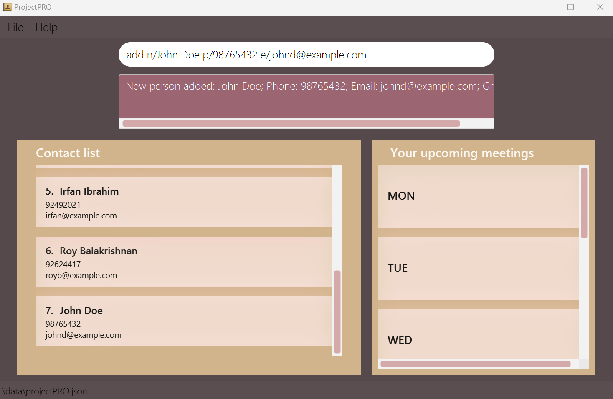

  
You have added John Doe to your contacts, at contact number 7.

**Potential error(s):**
- Incorrect format (e.g., no prefix, duplicate prefixes).
- The contact you are trying to add already exists in your contact list: `This person already exists in your contact list`.

--------------------------------------------------------------------------------------------------------------------

### Deleting a contact: `delete`
You can delete a contact from your contact list.

**Format:** `delete n/NAME`

    

    
    <h5 style="color: #56494C; margin: 0 0 5px 0; padding-top: 5px;"> Acceptable value(s)</h5>
  

  
<code style="color: #555; background-color: #F0C481; padding: 2px; border-radius: 2px;">NAME</code>
    must be alphanumeric, cannot be blank, and must be an existing contact in the contact list.

**Example(s):**
- `delete n/John Doe`  
  This deletes John Doe from the contact list.

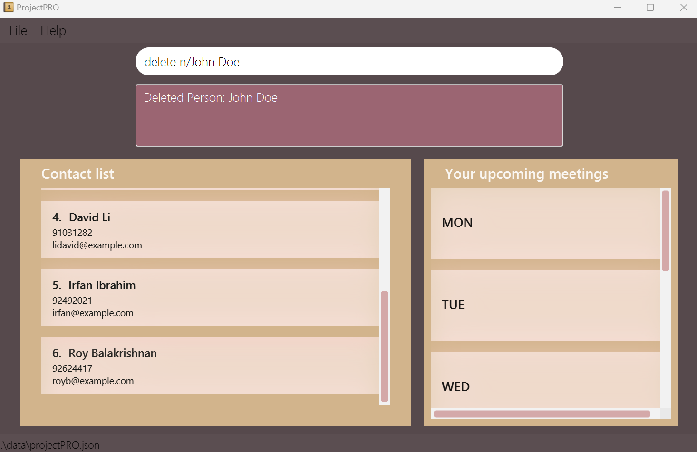

  
You have deleted John Doe, previously contact number 7, from your contacts.

**Potential error(s):**
- Invalid format (e.g., no prefix, duplicate prefixes).
- The contact you are trying to delete does not exist in your contact list: `No person with such name found. Please provide the person's full name as in the existing contact list`.

--------------------------------------------------------------------------------------------------------------------

### Finding a contact: `find`

You can find all the contacts from your contact list with the matching keywords.

**Format:** `find n/KEYWORDS_IN_NAME`

    

    
    <h5 style="color: #56494C; margin: 0 0 5px 0; padding-top: 5px;"> Acceptable value(s)</h5>
  

  
<code style="color: #555; background-color: #F0C481; padding: 2px; border-radius: 2px;">KEYWORDS_IN_NAME</code>
    must be alphanumeric and cannot be blank. It is <strong>not case-sensitive</strong>.

**Example(s):**
- `find n/alex bernice`

  This displays all the contacts with names containing Alex or Bernice.

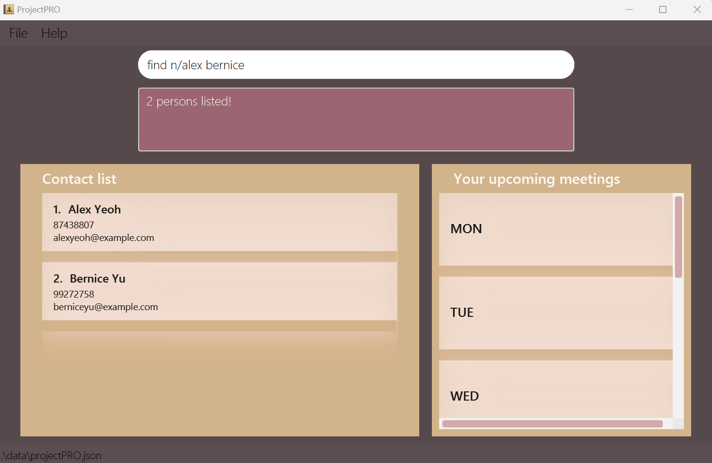

  
You have found all your contacts with the name Alex or Bernice.

**Potential error(s):**
- Invalid format (e.g., no prefix, duplicate prefixes).

--------------------------------------------------------------------------------------------------------------------

### Listing contacts: `list`
You can list all the contacts in your contact list.

**Format:** `list`

    

    
    <h5 style="color: #56494C; margin: 0 0 5px 0; padding-top: 5px;"> Acceptable value(s)</h5>
  

  

    No additional input required.

**Example(s):**
- `list`  
  This displays all the contacts in the contact list.

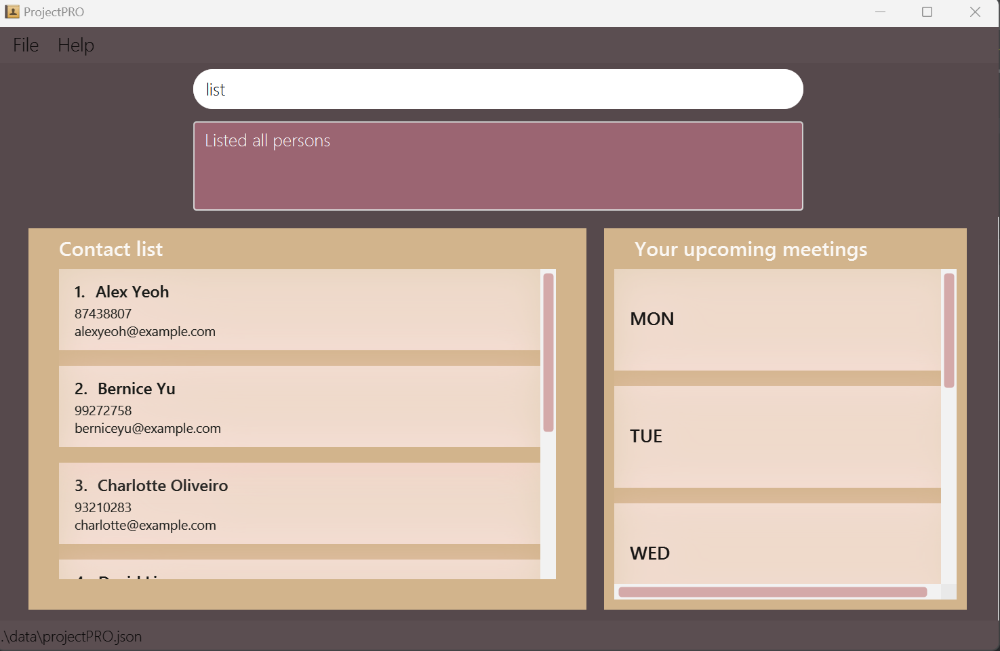

  
You have listed all the contacts in your contact list.

**Potential error(s):**
- Extra inputs detected.

[Back to Table of Contents](#table-of-contents)

--------------------------------------------------------------------------------------------------------------------

## Commands to Manage Groups

--------------------------------------------------------------------------------------------------------------------

### Adding a group: `new`

You can create a new group in your contact list.

**Format:** `new g/GROUP_NAME`

    

    
    <h5 style="color: #56494C; margin: 0 0 5px 0; padding-top: 5px;"> Acceptable value(s)</h5>
  

  
<code style="color: #555; background-color: #F0C481; padding: 2px; border-radius: 2px;">GROUP_NAME</code>
    must be alphanumeric, cannot be blank, and must not be an existing group in your contact list.

**Example(s):**
- `new g/CS2103T tp`  
  This creates a new group named "CS2103T tp".

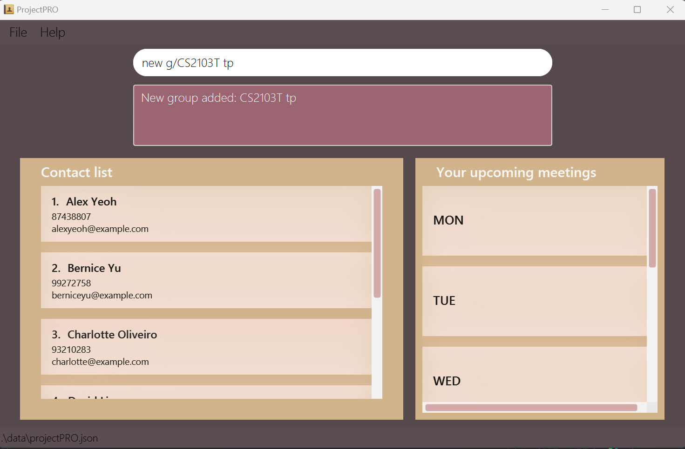

  
You have created a new group called CS2103T tp.

**Potential error(s):**
- Invalid command format (e.g., no prefix, duplicate prefixes).
- The group you are trying to add already exists in your contact list: `This group already exists in the contact list`.

--------------------------------------------------------------------------------------------------------------------

### Deleting a group: `delete`
You can delete a group in your contact list.

**Format:** `delete g/GROUP_NAME`

    

    
    <h5 style="color: #56494C; margin: 0 0 5px 0; padding-top: 5px;"> Acceptable value(s)</h5>
  

  
<code style="color: #555; background-color: #F0C481; padding: 2px; border-radius: 2px;">GROUP_NAME</code>
    must be alphanumeric, cannot be blank and must be an existing group in your contact list.

**Example(s):**
- `delete g/CS2103T tp`  
  This deletes the group "CS2103T tp" from your contact list, given "CS2103T tp" is an existing group in your contact list.

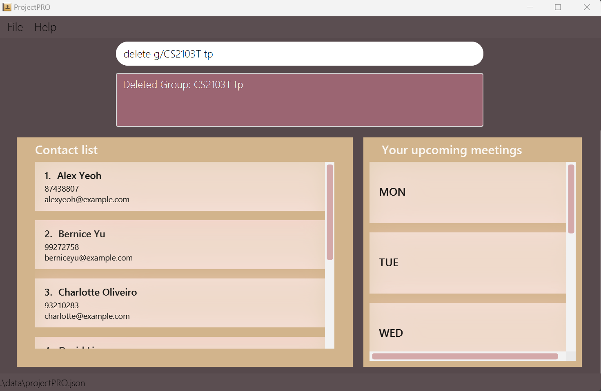

  
You have deleted the group "CS2103T tp" from your contact list.

**Potential error(s):**
- Incorrect format (e.g., no prefix, duplicate prefixes).
- The group you are trying to delete does not exist in your contact list: `No group with such name found. Please provide the group's full name as in the existing contact list`.

--------------------------------------------------------------------------------------------------------------------

### Adding remarks to a group: `remark`

You can add remarks to a group in your contact list.

**Format:** `remark g/GROUP_NAME r/REMARK`

  

    
    <h5 style="color: #56494C; margin: 0 0 5px 0; padding-top: 5px;"> Acceptable value(s)</h5>
  

  
<code style="color: #555; background-color: #F0C481; padding: 2px; border-radius: 2px;">GROUP_NAME</code>
    must be alphanumeric, cannot be blank and must be an existing group in your contact list.

  
<code style="color: #555; background-color: #F0C481; padding: 2px; border-radius: 2px;">REMARK</code>
    can take on any value.

**Example(s):**
- `remark g/CS2103T r/quiz tomorrow`  
  This adds the remark "quiz tomorrow" to the existing "CS2103T" group in your contact list.

  
You have added the group remark "quiz tomorrow" to the group "CS2103T" in your contact list.

**Potential errors(s):**
- Incorrect format (e.g. no prefix, duplicate prefixes).
- The group you entered does not exist in your contact list: `No group with such name found. Please provide the group's full name as in the existing contact list.`

--------------------------------------------------------------------------------------------------------------------

### Finding a group: `find`
You can find a group in your contact list. This allows you to view the group's members and remarks.

**Format:** `find g/GROUP_NAME`

    

    
    <h5 style="color: #56494C; margin: 0 0 5px 0; padding-top: 5px;"> Acceptable value(s)</h5>
  

  
<code style="color: #555; background-color: #F0C481; padding: 2px; border-radius: 2px;">GROUP_NAME</code>
    must be alphanumeric, cannot be blank and must be an existing group in your contact list.

**Example(s):**
- `find g/CS2103T`  
  This returns the members and remarks of the existing "CS2103T" group in your contact list.

  
You are now able to view all details regarding the group "CS2103T" in your contact list.

**Potential error(s):**
- Incorrect format (e.g. no prefix, duplicate prefixes).
- The group you are trying to find does not exist in your contact list: `No group with such name found. Please provide the group's full name as in the existing contact list`.

### Listing a group: `listgroup`
You can list all the groups in your contact list.

**Format:** `listgroup`

    

    
    <h5 style="color: #56494C; margin: 0 0 5px 0; padding-top: 5px;"> Acceptable value(s)</h5>
  

   No additional parameters.

**Example(s):**
- `listgroup`  
  This lists all the groups in your contact list.

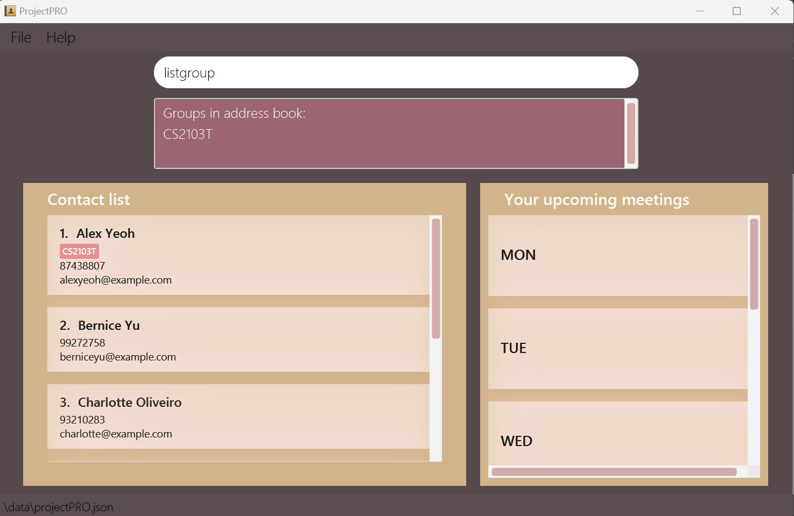

  
You have listed all the groups in your contact list.

**Potential error(s):**
- Extra inputs detected.

--------------------------------------------------------------------------------------------------------------------

### Grouping a Contact: `group`

You can add an existing contact to an existing group.

**Format:** `group n/NAME g/GROUP_NAME`

    

    
    <h5 style="color: #56494C; margin: 0 0 5px 0; padding-top: 5px;"> Acceptable value(s)</h5>
  

  
<code style="color: #555; background-color: #F0C481; padding: 2px; border-radius: 2px;">NAME</code>
    must be alphanumeric, cannot be blank, must be an existing contact in your contact list, and must not be a member of <code style="color: #555; background-color: #F0C481; padding: 2px; border-radius: 2px;">GROUP_NAME</code>.

  
<code style="color: #555; background-color: #F0C481; padding: 2px; border-radius: 2px;">GROUP_NAME</code>
    must be alphanumeric, cannot be blank, and must be an existing group in your contact list.

**Example(s):**
- `group n/Bernice Yu g/CS2103T`  
  This adds your contact "Bernice Yu" into the group "CS2103T".

  
You have added "Bernice Yu" to the group "CS2103T" in your contact list.

**Potential error(s):**
- Incorrect format (e.g., no prefix, duplicate prefixes).
- The contact you are trying to add is already a member of the group: `Bernice Yu is already in this group: CS2103T`.

--------------------------------------------------------------------------------------------------------------------

### Ungrouping a Contact: `ungroup`

You can remove a contact from a group.

**Format:** `ungroup n/NAME g/GROUP_NAME`

    

    
    <h5 style="color: #56494C; margin: 0 0 5px 0; padding-top: 5px;"> Acceptable value(s)</h5>
  

  
<code style="color: #555; background-color: #F0C481; padding: 2px; border-radius: 2px;">NAME</code>
    must be alphanumeric, cannot be blank, must be an existing contact in your contact list, and must be a member of <code style="color: #555; background-color: #F0C481; padding: 2px; border-radius: 2px;">GROUP_NAME</code>.

  
<code style="color: #555; background-color: #F0C481; padding: 2px; border-radius: 2px;">GROUP_NAME</code>
    must be alphanumeric, cannot be blank, and must be an existing group in your contact list.

**Example(s):**
- `ungroup n/Alex Yeoh g/CS2103T`  
  This removes your contact "Alex Yeoh" from the group "CS2103T".

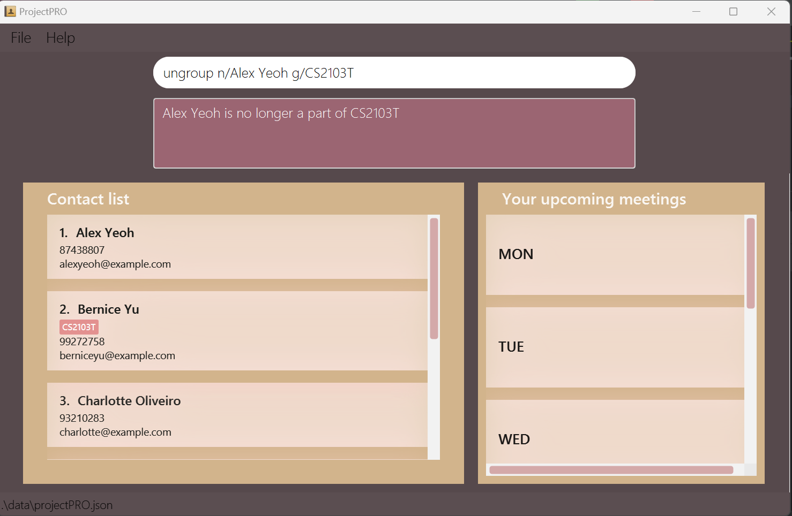

  
You have removed "Alex Yeoh" from the group "CS2103T".

**Potential error(s):**
- Incorrect format (e.g., no prefix, duplicate prefixes).
- The contact you are trying to remove is not a member of the group: `Alex Yeoh is not in this group: CS2103T`.

[Back to Table of Contents](#table-of-contents)

--------------------------------------------------------------------------------------------------------------------

## Commands to Manage Time

--------------------------------------------------------------------------------------------------------------------

### Adding Time to a Contact: `addtime`
You can add time slots when your contacts are available.

**Format:** `addtime n/NAME t/FREE_TIME`

    

    
    <h5 style="color: #56494C; margin: 0 0 5px 0; padding-top: 5px;"> Acceptable value(s)</h5>
  

   
<code style="color: #555; background-color: #F0C481; padding: 2px; border-radius: 2px;">    NAME</code>
     must be alphanumeric, cannot be blank and must be an existing contact in your contact list.
  

  
<code style="color: #555; background-color: #F0C481; padding: 2px; border-radius: 2px;">FREE_TIME</code>
  must be a time slot within the current weekly schedule. E.g. <code style="color: #555; background-color: #F0C481; padding: 2px; border-radius: 2px;">Sat 1000 - Mon 1000</code> is not allowed as the monday here refers to next week, violating the current weekly schedule pattern.

  
<code style="color: #555; background-color: #F0C481; padding: 2px; border-radius: 2px;">FREE_TIME</code>
  must be a time slot with some duration. E.g. <code style="color: #555; background-color: #F0C481; padding: 2px; border-radius: 2px;">Mon 1200 - Mon 1200</code> is not valid as there is no duration.<code style="color: #555; background-color: #F0C481; padding: 2px; border-radius: 2px;">Mon 1300- Mon 1400</code> is valid.
It is <strong>not case-sensitive</strong>.

  

    
    <h5 style="color: #56494C; margin: 0 0 5px 0; padding-top: 5px;;">Warning</h5>
  

  

<code style="color: #555; background-color: #FB9A9A; padding: 2px; border-radius: 2px;">FREE_TIME</code>
  must not clash with the other inputted/existing time slots of the contact. E.g. If time slot <code style="color: #555; background-color: #FB9A9A; padding: 2px; border-radius: 2px;">Mon 1200 - Mon 1300</code> has been added, then <code style="color: #555; background-color: #FB9A9A; padding: 2px; border-radius: 2px;">Mon 1300 - Mon 1400</code> can not be added. 

**Example(s):**
- `addtime n/Alex Yeoh  t/mon 1400 - mon 1600`  
This adds a time slot when Alex Yeoh is available in your contact list.

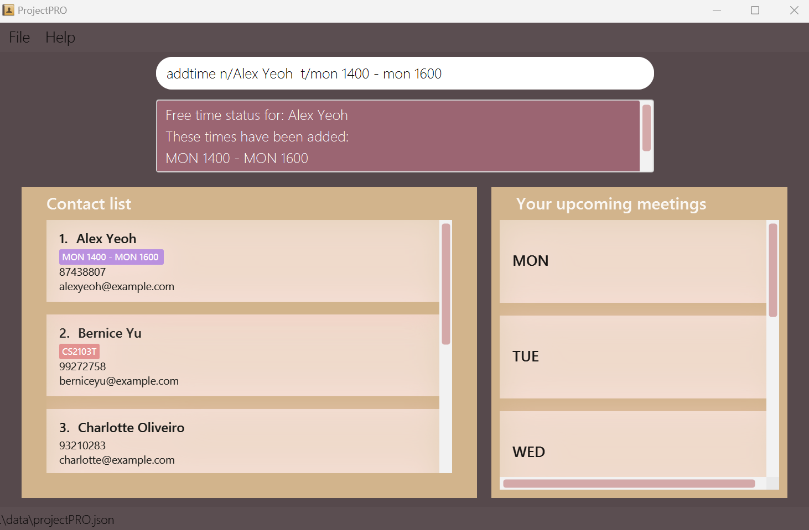

  
You have added the Monday 2 pm - 4 pm timeslot to Alex Yeoh to indicate that he is free during that time.

**Potential error(s):**
- Contact does not exist in the contact list.
- The time slot you are trying to add is not valid.

### Removing Time from a Contact: `deletetime`
You can remove available time slots of your contacts.

**Format:** `deletetime n/NAME t/FREE_TIME`

    

    
    <h5 style="color: #56494C; margin: 0 0 5px 0; padding-top: 5px;"> Acceptable value(s)</h5>
  

  
<code style="color: #555; background-color: #F0C481; padding: 2px; border-radius: 2px;">    NAME</code>
     must be alphanumeric, cannot be blank and must be an existing contact in your contact list.
  

  
<code style="color: #555; background-color: #F0C481; padding: 2px; border-radius: 2px;">FREE_TIME</code>
  must match the contact's existing time. It is <strong>not case-sensitive</strong>.

  

    
    <h5 style="color: #56494C; margin: 0 0 5px 0; padding-top: 5px;;">Warning</h5>
  

 
<code style="color: #555; background-color: #FB9A9A; padding: 2px; border-radius: 2px;">FREE_TIME</code>
  must not clash with other inputted time slots.

**Example(s):**
- `deletetime n/Alex Yeoh  t/mon 1400 - mon 1600`  
  This removes a time slot when Alex Yeoh is available from your contact list.

  
You have deleted the Monday 2 pm - 4 pm time slot from Alex Yeoh to indicate that he is not free during that time anymore.

**Potential error(s):**
- Contact does not exist in the contact list.
- Time slot does not exist for the contact.
- Invalid time slot format.

--------------------------------------------------------------------------------------------------------------------

### Listing Time from a Contact: `listtime`
You list all available time slots of your contacts.

**Format:** `listtime n/NAME`
- Provide the full name of the contact using the `n/` prefix.

  

    
    <h5 style="color: #56494C; margin: 0 0 5px 0; padding-top: 5px;"> Acceptable value(s)</h5>
  

  
<code style="color: #555; background-color: #F0C481; padding: 2px; border-radius: 2px;">NAME</code> 
    must be alphanumeric, cannot be blank and must be an existing contact in your contact list.

**Example(s):**
- `listtime n/Alex Yeoh`  
  This lists all time slots when Alex Yeoh is available from your contact list.

  
You have listed Alex Yeoh's free times.

**Potential error(s):**
- Contact does not exist in the contact list.

--------------------------------------------------------------------------------------------------------------------

### Add Meeting to a Group: `addmeeting`
You can add a meeting time slot for your group.

**Format:** `addmeeting g/GROUP_NAME t/MEETING_TIME`

  

    
    <h5 style="color: #56494C; margin: 0 0 5px 0; padding-top: 5px;"> Acceptable value(s)</h5>
  

  
<code style="color: #555; background-color: #F0C481; padding: 2px; border-radius: 2px;">GROUP_NAME</code>
    must be alphanumeric, cannot be blank and must be an existing group in your contact list.

<code style="color: #555; background-color: #F0C481; padding: 2px; border-radius: 2px;">MEETING_TIME</code>
    must be a time slot within the weekly schedule and must not clash with the group's existing meeting times.  It is <strong>not case-sensitive</strong>.

  

    
    <h5 style="color: #56494C; margin: 0 0 5px 0; padding-top: 5px;;">Warning</h5>
  

  
<code style="color: #555; background-color: #FB9A9A; padding: 2px; border-radius: 2px;">MEETING_TIME</code>
    can be added even if some members are not available for the time slot. Do coordinate with your group members on the most suitable time slots.

**Example(s):**
- `addmeeting g/CS2103T  t/mon 1400 - mon 1600`  
  This adds a meeting for the group "CS2103T".

  
You have added a Monday 2 pm - 4 pm meeting for the group "CS2103T".

**Potential error(s):**
- Group does not exist in the contact list.
- Invalid time slot format.

--------------------------------------------------------------------------------------------------------------------

### Remove Meeting Time from a Group: `deletetime`
You can remove meeting times from your groups.

**Format:** `deletetime g/GROUP_NAME t/MEETING_TIME`

  

    
    <h5 style="color: #56494C; margin: 0 0 5px 0; padding-top: 5px;"> Acceptable value(s)</h5>
  

  
<code style="color: #555; background-color: #F0C481; padding: 2px; border-radius: 2px;">GROUP_NAME</code>
    must be alphanumeric, cannot be blank and must be an existing group in your contact list.

  
<code style="color: #555; background-color: #F0C481; padding: 2px; border-radius: 2px;">MEETING_TIME</code>
    must be a time slot within a weekly schedule and must be an existing meeting slot of the group. It is <strong>not case-sensitive</strong>.

**Example(s):**
- `deletetime g/CS2103T t/mon 1400 - mon 1600`  
  This removes a meeting time slot from the group "CS2103T".

  
You have deleted the Monday 2 pm - 4 pm meeting for the group "CS2103T".

**Potential error(s):**
- Group does not exist in the contact list.
- Group does not contain meeting time.
- Invalid time slot format.

--------------------------------------------------------------------------------------------------------------------

### Listing Meeting Time from a Group: `listtime`
You list meeting time for your groups.

**Format:** `listtime g/GROUP_NAME`

  

    
    <h5 style="color: #56494C; margin: 0 0 5px 0; padding-top: 5px;"> Acceptable value(s)</h5>
  

  
<code style="color: #555; background-color: #F0C481; padding: 2px; border-radius: 2px;">GROUP_NAME</code>
    must be alphanumeric, cannot be blank and must be an existing group in your contact list.

**Example(s):**
- `listtime g/CS2103T`  
  This lists all meeting times of the CS2100 group.

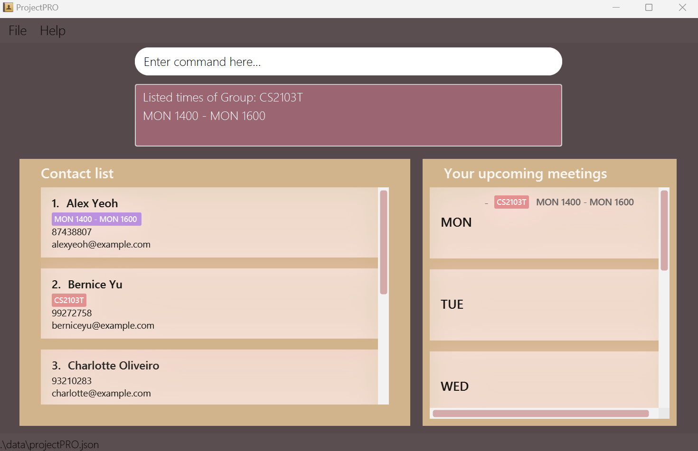

  
You can see all the meetings you have for CS2103T/p>

**Potential error(s):**
- Group does not exist in the contact list.

--------------------------------------------------------------------------------------------------------------------

### Finding Free Time of a Group: `findfreetime`
You can find a meeting time slot for your group where everyone is available.

**Format:** `findfreetime g/GROUP_NAME d/DURATION`

  

    
    <h5 style="color: #56494C; margin: 0 0 5px 0; padding-top: 5px;"> Acceptable value(s)</h5>
  

  
<code style="color: #555; background-color: #F0C481; padding: 2px; border-radius: 2px;">GROUP_NAME</code>
    must be alphanumeric, cannot be blank and must be an existing group in your contact list.

  
<code style="color: #555; background-color: #F0C481; padding: 2px; border-radius: 2px;">DURATION</code>
    must be a whole number representing the meeting duration in minutes.

  

    
    <h5 style="color: #56494C; margin: 0 0 5px 0; padding-top: 5px;;">Warning</h5>
  

  
<code style="color: #555; background-color: #FB9A9A; padding: 2px; border-radius: 2px;">GROUP_NAME</code>
    must contain contacts with their free time slots. 

**Example(s):**
- `findfreetime g/CS2103T d/60`  
  This shows you all possible 60-minute meeting slots for your CS2103T group.

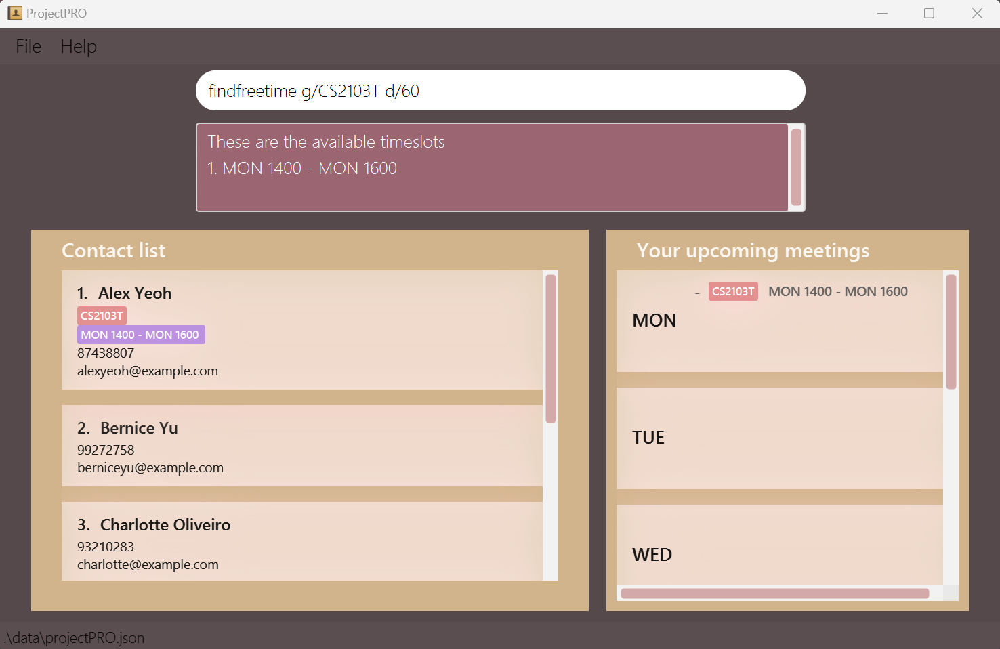

  
You are now able to view all possible meeting times of at least 60 minutes for the group "CS2103T".

**Potential error(s):**
- Group does not exist in the contact list.
- Contacts in the group did not add their available time slots.

[Back to Table of Contents](#table-of-contents)

--------------------------------------------------------------------------------------------------------------------

## General Commands

--------------------------------------------------------------------------------------------------------------------

### Viewing Help: `help`
You can view the link to our User Guide.

**Format:** `help`

  

    
    <h5 style="color: #56494C; margin: 0 0 5px 0; padding-top: 5px;"> Acceptable value(s)</h5>
  

  

    No additional input required.

**Example(s):**
- `help`

  This displays the link to the User Guide.

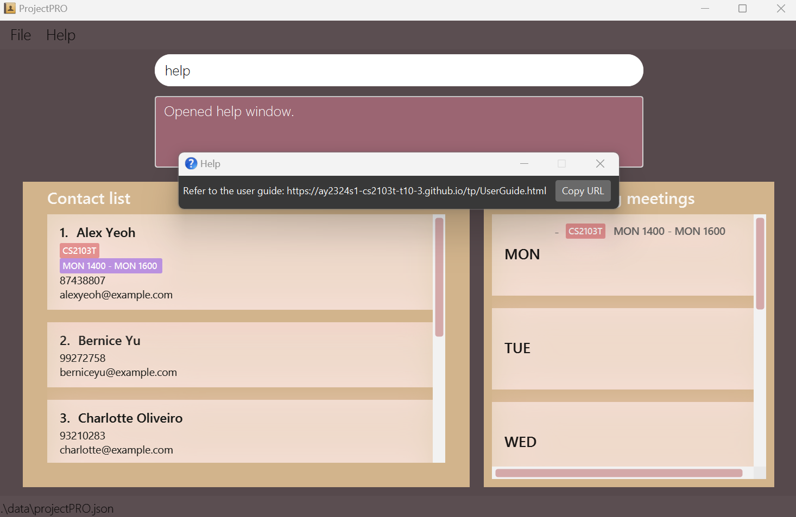

  
You are now able to click on the User Guide link for further guidance.

**Potential error(s):**
- Extra inputs detected.

--------------------------------------------------------------------------------------------------------------------

### Clearing All Data: `clear`
Clears all entries from the contact list.

**Format:** `clear`

  

    
    <h5 style="color: #56494C; margin: 0 0 5px 0; padding-top: 5px;"> Acceptable value(s)</h5>
  

  

    No additional input required.

**Example(s):**
- `clear`

  This clears all the data in your contact list.

  
You have cleared all the data in your contact list.

**Potential error(s):**
- Extra inputs detected.

### Exit ProjectPRO: `exit`
You can exit ProjectPRO.

**Format:** `exit`

  

    
    <h5 style="color: #56494C; margin: 0 0 5px 0; padding-top: 5px;"> Acceptable values</h5>
  

  

    No additional input required.

**Potential error(s):**
- Extra inputs detected.

--------------------------------------------------------------------------------------------------------------------

### Saving the data
ProjectPRO saves automatically after any command changes the data. There is no need to save manually.

--------------------------------------------------------------------------------------------------------------------

### Editing the data file
ProjectPRO's data are saved automatically as a JSON file `[JAR file location]/data/addressbook.json`. Advanced users are welcome to update data directly by editing that data file.

  

    
    <h5 style="color: #56494C; margin: 0 0 5px 0; padding-top: 5px;;">Warning</h5>
  

    If your changes to the data file makes its format invalid, ProjectPRO will discard all data and start with a sample data file. Hence, it is recommended to take a backup of the file before editing it.

[Back to Table of Contents](#table-of-contents)
